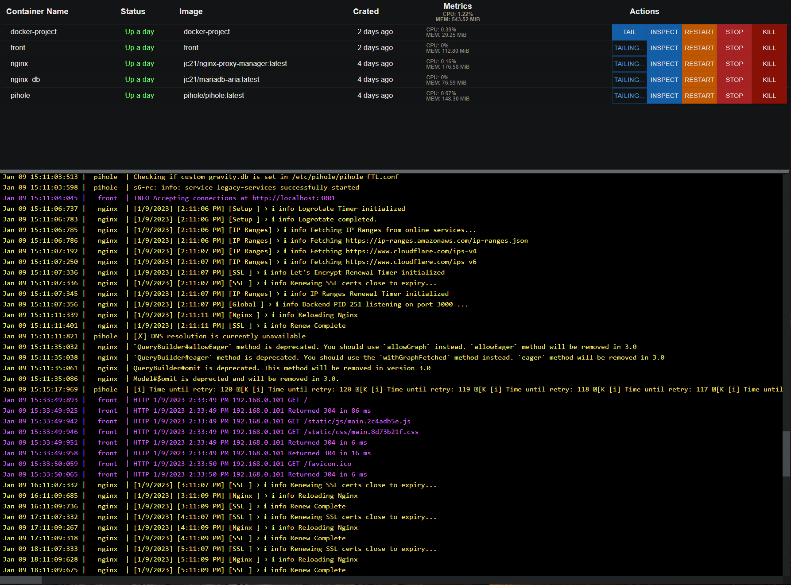

# Docker Project
### Maybe not the prettiest but works

## Goal
Be better faster stronger

## Example WS messages
[api docs](https://github.com/fr-str/docker-project/blob/master/api/actions/README.md)

### CANDO
 - [X] ws api
 - [X] live container statuses
 - [X] live logs
 - [X] start/stop(restart) containers
 - [X] delete containers
 - [X] apply docker-compse

### TODO
 - [ ] better name
 - [ ] find a frontend dev
 - [ ] create containers
 - [ ] attach to containers
 - [ ] better way to navigate thru logs
 - [ ] make it a .service
 - [ ] ~~multi node (local network)~~ not going to implement, just use kubernetes i guess
